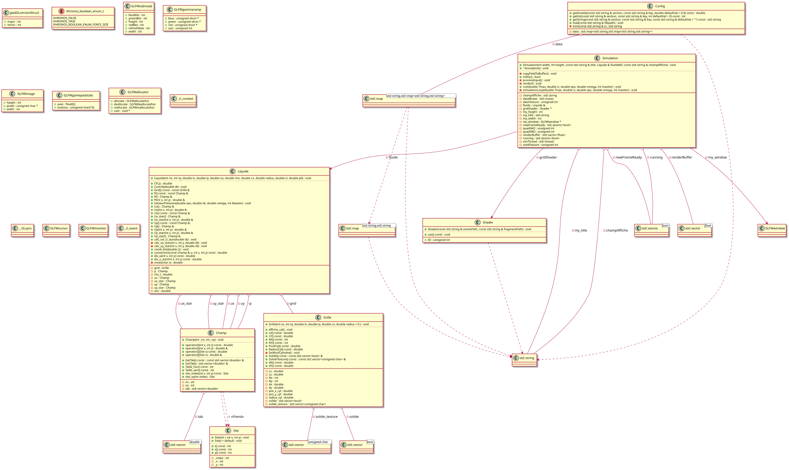

# Crazy cylinder : simulation of the experiment
This file will contain explanation of the different part of the code, and maybe some link to the theory used for the numerical simulation.

# CFD 2D – Simulation de fluide incompressible

Ce projet implémente un **solveur CFD 2D** pour simuler un fluide incompressible autour d'un obstacle (cylindre) sur une grille rectangulaire. Le code est écrit en **C++** et utilise une architecture orientée objet pour la grille, les champs et le liquide. La simulation est visualisée en temps réel grâce à **OpenGL**, dans une fenêtre interactive tournant en parallèle du calcul physique.

---

## Structure du projet

- **Grille**  
  Gère la grille 2D, le pas de discrétisation, et l'obstacle circulaire via un masque de cellules solides. Calcule deux masques : un masque physique (`solide`) pour le solveur, et un masque texturé (`solide_texture`) pour l'affichage OpenGL.

- **Champ / Site**  
  Représente les champs scalaires ou vectoriels (vitesse, pression), avec accès facile par coordonnées `(x, y)` ou index 1D via `Site`.

- **Liquide**  
  Contient les vitesses, la pression, les champs intermédiaires et fournit des fonctions CFD pour calculer la divergence et le terme convectif.

- **Solveur**  
  Fonctions pour calculer le Laplacien, les gradients centraux et upwind, nécessaires pour résoudre les équations de Navier-Stokes.

- **Simulation**  
  Gère la fenêtre OpenGL et le rendu en temps réel. Le calcul physique tourne dans un **thread séparé** (`simulationLoop`) pour ne pas bloquer l'affichage. Un mutex protège les données partagées lors des courtes copies vers le buffer de rendu.

- **Shader**  
  Charge et compile les shaders GLSL depuis le dossier `SHADERS/`. Les fichiers `grid.vert` et `grid.frag` gèrent respectivement la géométrie du quad plein écran et le coloriage des cellules (solide / fluide).

- **Config**  
  Lecteur de fichier INI sans dépendance externe. Charge les paramètres physiques et numériques depuis `config.ini` au démarrage.

- **Export**  
  Export des champs physiques (vitesse, pression) en fichiers CSV en fin de simulation.

Les relations entre ces classes se trouvent dans `diagrams/uml_diagram.svg`.



---

## Fonctionnalités principales

- Simulation de fluide autour d'un cylindre (obstacle solide).
- Accès aux champs modifiable ou en lecture seule via opérateurs `(x, y)` ou `Site`.
- Calcul des gradients centraux et upwind pour stabiliser la convection.
- Calcul de divergence pour la projection incompressible.
- Solveur **SOR multigrid** pour la pression.
- Pas de temps adaptatif vérifiant la condition **CFL**.
- Affichage en temps réel grâce à **OpenGL** (quad plein écran + texture mise à jour dynamiquement).
- Calcul physique dans un **thread séparé** pour garder la fenêtre réactive.
- Paramètres configurables via un fichier **INI** sans recompilation.
- Export des champs en **CSV** pour post-traitement.

---

## Compilation du projet

Ce projet utilise `cmake` ≥ 3.23 et requiert les dépendances suivantes :
- **GLFW** : gestion de la fenêtre et des événements (inclus dans `DEP/GLFW/`)
- **GLAD** : chargement des fonctions OpenGL (inclus dans `DEP/GLAD/`)
- **OpenGL** : rendu graphique
- **pthreads** : threading POSIX (ajouté automatiquement via `Threads::Threads`)

Pour compiler, se placer à la racine du projet, puis :
```bash
cmake -B build/
cmake --build build/
```

L'exécutable se trouve alors dans `build/SRC/`. Pour recompiler complètement, supprimer le dossier `build/` et recommencer.

> **Note** : le dossier `SHADERS/` doit être accessible depuis le répertoire de travail au moment de l'exécution. Le `CMakeLists.txt` copie automatiquement ce dossier dans le répertoire de build via `file(COPY ...)`.

---

## Configuration (`config.ini`)

Tous les paramètres physiques et numériques sont centralisés dans `config.ini` à la racine du projet. Le fichier est copié automatiquement dans le dossier de build par CMake.

```ini
[grille]
nx     = 1024       ; nombre de cellules en x
ny     = 1024       ; nombre de cellules en y
lx     = 1.0        ; longueur physique en x (m)
ly     = 15.0       ; longueur physique en y (m)

[fluide]
nu     = 1e-6       ; viscosité cinématique (m²/s)
rho    = 1.0        ; masse volumique (kg/m³)
U      = 0.5        ; vitesse d'entrée (m/s)
p0     = 1e5        ; pression initiale (Pa)

[cylindre]
cx     = 0.5        ; position x du centre (m)
radius = 0.0        ; rayon (m) — 0 = pas de cylindre

[simulation]
Tmax    = 2.0       ; temps physique final (s)
eps     = 1e-1      ; tolérance du solveur de pression
maxiter = 10        ; itérations max du solveur de pression

[export]
output_dir = output ; dossier de sortie des CSV
```

Toutes les clés ont une valeur par défaut dans le code : si une clé est absente, la simulation tourne quand même. Un chemin alternatif peut être passé en argument :

```bash
./Projet chemin/vers/autre_config.ini
```

---

## Affichage OpenGL

La simulation s'affiche dans une fenêtre OpenGL en temps réel pendant le calcul. L'architecture repose sur deux threads :

- **Thread principal** : gère la fenêtre GLFW, le rendu et les événements (touches clavier). Tourne à chaque frame sans blocage.
- **Thread secondaire** (`simulationLoop`) : effectue les calculs physiques (CFD). Copie rapidement les données dans un buffer partagé sous mutex entre deux pas de temps.

Le masque solide (cylindre) est chargé une seule fois dans une texture OpenGL au démarrage et n'est jamais modifié. Les cellules solides s'affichent en rouge, le fluide en noir.

Appuyer sur **Échap** ferme la fenêtre et arrête proprement les deux threads.

---

## Export CSV

À la fin de la simulation, les champs sont exportés automatiquement dans le dossier `output_dir` défini dans `config.ini` :

| Fichier  | Contenu                     |
|----------|-----------------------------|
| `ux.csv` | Composante x de la vitesse  |
| `uy.csv` | Composante y de la vitesse  |
| `p.csv`  | Champ de pression           |

Chaque fichier contient les coordonnées physiques du centre de chaque cellule et la valeur du champ :

```
x,y,ux
9.765625e-04,9.765625e-04,0.000000e+00
...
```

### Visualisation avec Python

```python
import pandas as pd
import matplotlib.pyplot as plt

df = pd.read_csv("output/uy.csv")
nx, ny = 1024, 1024
U = df["uy"].values.reshape(ny, nx)

plt.figure(figsize=(4, 12))
plt.imshow(U, origin="lower", cmap="RdBu_r")
plt.colorbar(label="uy (m/s)")
plt.title("Vitesse verticale")
plt.tight_layout()
plt.savefig("uy.png", dpi=150)
```

---

## Diagramme UML
Pour générer automatiquement le diagramme UML du projet :
- `clang-uml` à la racine du projet
- `plantuml -tsvg diagrams/*.puml` à la racine aussi

## Authors
Jules Chamoy and Lofty Gauthier
